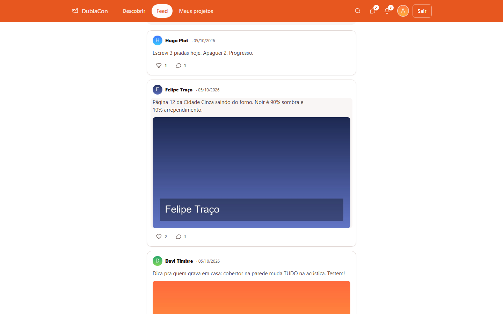
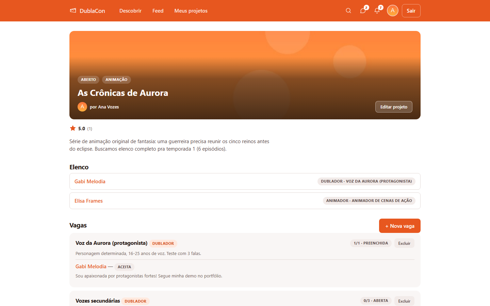
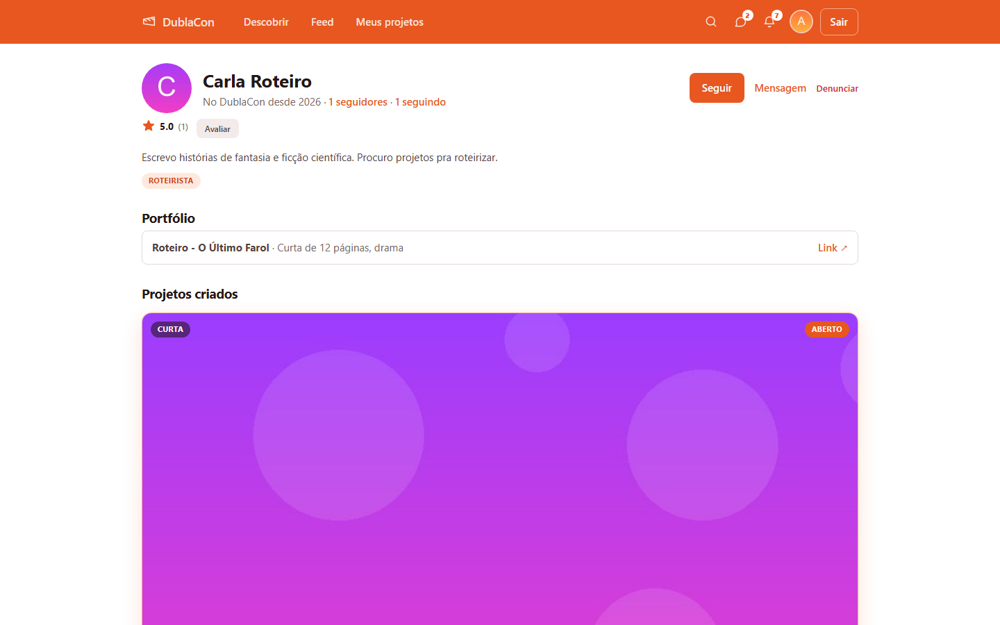
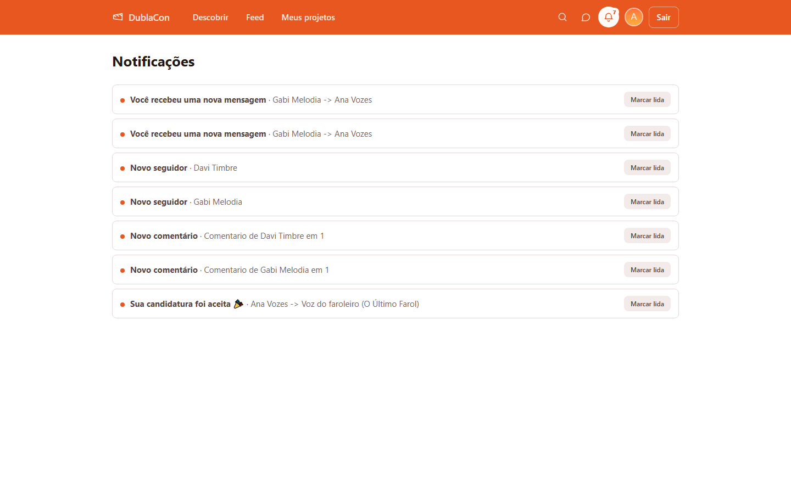

# DublaCon

A social network where amateur voice actors, animators, artists and writers find each other by applying to role openings in creative projects.

## What it does

- Anyone can publish a project (animated series, fandub, audio drama, comic) and open slots per role: voice actor, animator, artist, writer, editor.
- Members browse open projects with category and role filters, then apply with a message and an optional voice test (audio file). The owner accepts or declines, and accepted applicants show up as the project's cast.
- A feed with regular posts and project updates, likes, comments and a "Following" tab.
- Public profiles with a portfolio (links or uploaded files), star ratings, followers, people search and 1:1 direct messages.
- Notifications for applications, messages, comments, ratings, new followers and verification decisions, with an unread badge.
- Admin tools: a moderation queue for user reports and bug reports, account bans, verification badges and site-wide announcements.

## Interesting parts

- **CPF encrypted at rest, still unique.** The CPF (Brazilian tax ID) is stored through `EncryptedCharField` ([`backend/accounts/crypto_fields.py`](backend/accounts/crypto_fields.py)), which encrypts with Fernet on write and decrypts on read. Fernet uses a random IV, so the same CPF never produces the same ciphertext and a UNIQUE constraint on that column would not work. Uniqueness lives in a separate `cpf_hash` column: an HMAC-SHA256 of the digits, keyed with the same secret, with a UNIQUE constraint in the database. Check digits are validated on sign-up, and the CPF never appears in public profile responses. Admins only see it when reviewing a professional actor verification request.
- **Uploads are checked by content, not just by extension.** `SanitizedImageField` ([`backend/common/images.py`](backend/common/images.py)) decodes every uploaded image with Pillow and writes a fresh JPEG or PNG, so EXIF, GPS, XMP and anything appended to the original bytes are dropped. Files that do not decode as images are rejected whatever their extension (a text file renamed to `.jpg` gets a 400), and images over 5 MB are rejected at validation time. Used for avatars, project covers, post photos, report evidence, bug screenshots and verification documents. Audio files (voice tests and portfolio items) must start with the signature of their declared format (ID3 tag or MPEG frame sync for MP3, `RIFF`/`WAVE`, `OggS`, `ftyp` for M4A), so an HTML file renamed to `.mp3` also gets a 400.
- **Moderation and reports.** Users can report another user with a reason, a description and photo evidence; reports and bug reports go to an admin queue, and only admins can change their status. Admins can ban or unban accounts (other admins cannot be banned) and optionally block new sign-ups from the banned user's registration IP. The IP block is a weak layer on purpose; the real ban is the deactivated account plus the unique CPF hash, which stops the same person from signing up again.
- **Ratings with review.** Users and projects get 1 to 5 star ratings. A rating of 2 or less requires a reason and is held for review (via the Django admin), and only approved ratings count toward the average, which is computed on read instead of cached.
- **Verification badges.** Users can request an "influencer" or "professional actor" badge. The professional actor registry (DRT) has no public API, so an admin checks the registration number by hand; the API normalizes it to the 7-digit format the official lookup expects.
- **Rate limits that leave polling alone.** Scoped throttles cover login (10/min), sign-up (20/hour), password reset (5/hour) and writes (30/min). The write throttle ignores GET requests, so the frontend's polling (every 30 s for the unread badge, every 5 s inside an open chat) never trips it.
- **Password reset without account enumeration.** The reset endpoint returns the same response whether or not the email has an account.

## Stack

- **Backend:** Python 3.12, Django 6, Django REST Framework (token and session auth), PostgreSQL 16 with psycopg 3, cryptography (Fernet), Pillow
- **Frontend:** React 19, Vite 8, React Router 7, plain CSS, oxlint
- **Tooling:** Docker Compose (Postgres, backend, frontend and a SonarQube server for local static analysis)

Product and design notes, in Portuguese, are in [`docs/PRODUCT.md`](docs/PRODUCT.md) and [`docs/DESIGN.md`](docs/DESIGN.md).

## Run it locally

Requirements: Docker with Compose.

```bash
cp .env.example .env                    # then set DB_PASSWORD
cp backend/.env.example backend/.env

# Generate the two keys and paste them into backend/.env (SECRET_KEY and FIELD_ENCRYPTION_KEY)
docker compose run --rm --no-deps backend python -c "import secrets; print(secrets.token_urlsafe(50))"
docker compose run --rm --no-deps backend python -c "from cryptography.fernet import Fernet; print(Fernet.generate_key().decode())"

docker compose up --build -d
docker compose exec backend python manage.py migrate
```

Optional demo data (8 users, 6 projects, 11 role openings, posts, comments, messages, follows and ratings, with generated images):

```bash
docker compose exec -T backend python manage.py shell -c "exec(open('seed.py').read())"
```

All demo accounts (for example `ana.voz@example.com`) share one password, printed at the end of the seed as `Demo password: ...`. It is `DEMO_PASSWORD` from `backend/.env` when set; otherwise the seed generates a random one, which is shown only that time.

To use the admin tools, create a superuser. It asks for an email, a name and a valid CPF; a generated test number such as `00000000191` works. The moderation and announcements pages are linked from the Settings page ("Configurações").

```bash
docker compose exec backend python manage.py createsuperuser
```

| Service | URL |
|---|---|
| Frontend | http://localhost:5190 |
| API | http://localhost:8010/api/ |
| Django admin | http://localhost:8010/admin/ |
| SonarQube | http://localhost:9010 |
| Postgres | `localhost:5442` (database and user: `dublacon`, password: `DB_PASSWORD` from `.env`) |

The ports are not the defaults so the stack can run next to other local projects. In development, password reset emails are printed to the backend logs (`docker compose logs backend`).

## Tests

```bash
docker compose exec backend python manage.py test
docker compose exec frontend npm run lint
docker compose exec frontend npm run build
```

The backend has 20 API tests covering bans and IP blocking, the verification flow, follows and their notifications, feed permissions, upload validation and absolute media URLs (the frontend and the API run on different origins). The frontend has no automated tests yet; lint and build are the checks.

## Screenshots


Feed with community posts, likes and comments.


Project page seen by its owner: confirmed cast, role openings and an accepted application.


Public profile with rating, roles, portfolio and the projects the person created.


Notifications for messages, new followers, comments and accepted applications.

## Project status

A side project I built to study Django REST Framework and React end to end. It runs locally with Docker Compose and has not been deployed. The interface is in Brazilian Portuguese. Known gaps: no frontend tests, notifications use polling instead of WebSockets, the containers run the development servers (`runserver` and the Vite dev server), and sending real email needs SMTP settings that are not wired up yet.

Built with AI coding assistants as part of my workflow.

## Versão em português

DublaCon é uma rede social para dubladores, animadores, desenhistas e roteiristas amadores: quem cria um projeto abre vagas por papel e quem quer participar se candidata.
O backend usa Django REST Framework com PostgreSQL e o frontend usa React com Vite.
O CPF fica criptografado no banco (Fernet) e um hash HMAC garante que cada CPF só tenha uma conta; toda imagem enviada é regravada a partir dos pixels, o que remove metadados como EXIF e GPS.
Para rodar, siga a seção "Run it locally" acima. É um projeto pessoal de estudo, sem deploy.
